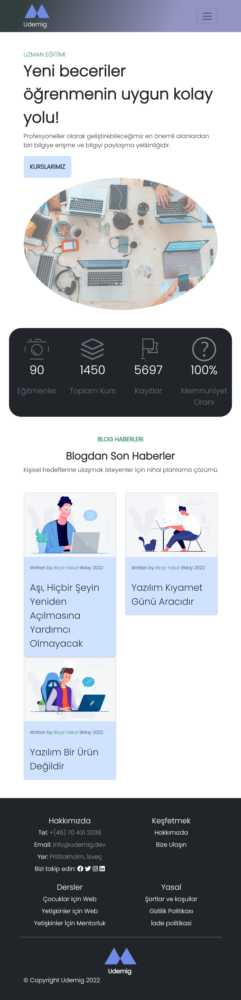

# Bootstrap Project

This project showcases a web page example developed using HTML, CSS (SCSS), and Bootstrap. Our goal is to demonstrate how different technologies can be combined and to provide a user-friendly interface.

## `Features`

- **Bootstrap Usage:** The page design and components are created using the Bootstrap framework.

- **SCSS Integration:** SCSS (Sass) is used for CSS styling, enabling the creation of more organized and maintainable style files.

- **Visual Enhancements:** The page is developed with aesthetically pleasing images and designs.

- **Responsive Design:** The web page is designed to be responsive for different screen sizes.

---

## `Technologies Used`

- **HTML:** The structure of the web page is created using HTML.

- **SCSS (Sass):** SCSS is used to create more organized and maintainable CSS code.

- **Bootstrap:** The framework is used for responsive design and creating components.

---

## `How to Use`

1. Visit the Web Page: Access the project in your browser to view the web page.

2. Experience Responsive Design: Explore how the page looks on different screen sizes to understand its responsive design.

---

## `Deploy`

The project is live and can be accessed from the following URL: [https://bs-udemig.netlify.app/](https://bs-udemig.netlify.app/).

---

## `Responsive Design Preview`

## 

## `Screen`

